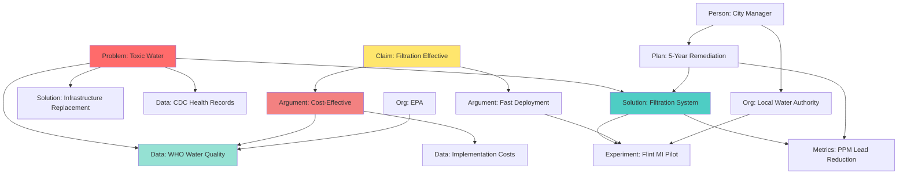
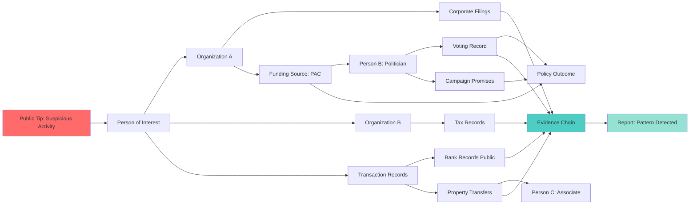
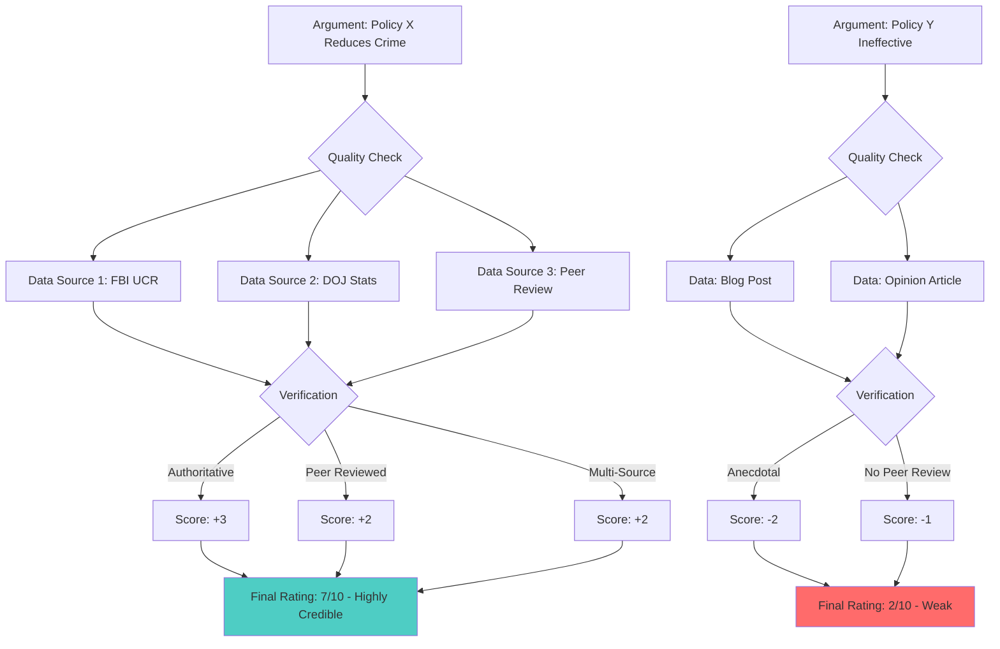
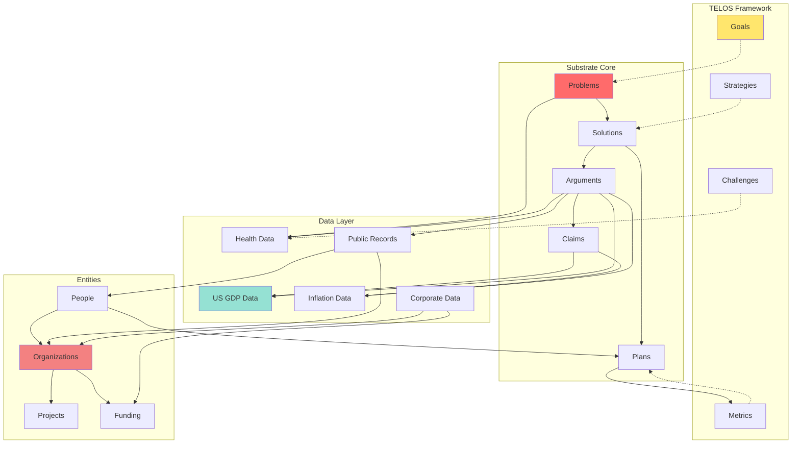

# Substrate

**An open-source framework for capturing, organizing, and analyzing different aspects of human civilization**

[About](#about) • [Updates](#-recent-updates) • [Data](#-data-directory) • [Docs](#-documentation) • [Contributing](#how-to-contribute)

---

## About

### The Philosophy

**Substrate doesn't provide conclusions. It provides components.**

We're building a repository of structured, machine-readable components that anyone can use to support their own analysis, research, or decision-making:

- **Data** - Authoritative datasets with full source documentation
- **Problems** - Documented challenges with scope and evidence
- **Solutions** - Proposed approaches with implementation details
- **Arguments** - Reasoning chains with quality indicators
- **Claims** - Assertions that can be linked to supporting evidence
- **Plans** - Political platforms, policy proposals, action roadmaps
- **Metrics** - Success criteria and measurement frameworks
- **Ideas** - Concepts and frameworks for consideration
- **People** - Individuals involved in initiatives and organizations
- **Organizations** - Entities working on problems and solutions
- **Projects** - Active initiatives with goals and outcomes

**You decide what to do with them.** Connect them. Analyze them. Build arguments. Test hypotheses. Create visualizations. Make your own conclusions.

Substrate is infrastructure, not analysis. We provide the pieces in standardized formats. You (and your AI) determine what they mean and how they connect.

### Human & AI Collaboration

**Substrate provides the pieces. You and your AI create the connections.**

We don't prescribe how everything links together—we provide the **raw components** (problems, solutions, data, claims, arguments, people, organizations) in structured, machine-readable formats. The mappings happen organically:

- **Humans discover connections** - "This solution worked for that problem in 3 cities"
- **AI systems suggest links** - "These 5 arguments all reference the same dataset"
- **Patterns emerge automatically** - "Every organization in this funding network connects to these 3 politicians"
- **Connections grow over time** - As more data and entities are added, new relationships surface

Everything in Substrate is designed to be parsed and analyzed by **both humans and AI systems**:

- **Human-readable formats** - CSV and Markdown files anyone can open and understand
- **Machine-parseable structures** - Consistent formats AI can query and analyze
- **Complete documentation** - Full methodology and source evaluation for every dataset
- **Standardized identifiers** - Link entities across datasets without ambiguity

This dual accessibility enables a new kind of collaboration: humans contribute the pieces and initial insights, AI systems analyze thousands of components simultaneously to find patterns and suggest connections that would be impossible to spot manually. The system becomes more valuable as more people and AIs explore it, each discovering and documenting new linkages.

### The Vision

By connecting claims to arguments, arguments to data, and data to authoritative sources, Substrate creates a **foundation for mutual understanding**. When we disagree, we can trace our reasoning back through evidence to see exactly where our perspectives diverge. When we agree, we can build on verified knowledge rather than assumptions.

### Transparency & Accountability

Substrate's interconnected structure enables powerful transparency use cases:

**🔍 OSINT & Investigation**
- Cross-reference public records, corporate filings, and government data
- Link people, organizations, and financial flows across datasets
- Surface connections that would be invisible in isolated databases
- Track influence networks and funding relationships

**📊 Criminal Investigation Support**
- Connect individuals to organizations, transactions, and locations using public data
- Build evidence chains linking claims to verifiable records
- Correlate timeline data across multiple authoritative sources
- Enable pattern detection across datasets (fraud, corruption, illicit networks)

**🌐 Public Accountability**
- Verify claims made by public figures against documented evidence
- Track campaign promises against actual policy outcomes and metrics
- Link political donations to voting records and policy positions
- Monitor government spending against stated goals and results

This isn't just an academic exercise—it's infrastructure for transparency and progress. Whether you're a researcher seeking ground-truth data, an investigator cross-referencing public records, a journalist fact-checking claims, or a citizen trying to understand complex issues, Substrate provides a trusted foundation built on verifiable evidence and open data.

### How to Contribute

**Anyone can submit components to Substrate.** No gatekeeping on ideas—just structured formats.

**What You Can Submit:**

**📋 Problems** - Document challenges at any scale
- "Declining water quality in Flint, Michigan"
- "Rising healthcare costs in rural communities"
- "Climate change impact on coastal cities"

**💡 Solutions** - Propose approaches (tested or theoretical)
- "Implement filtration systems at municipal level"
- "Establish rural telemedicine networks"
- "Relocate infrastructure inland over 20-year period"

**📊 Plans** - Submit actionable strategies
- Political platforms for running for office
- Policy proposals for city/state/national government
- Corporate action plans for organizational change
- Community initiatives with implementation timelines

**📈 Metrics** - Define how success should be measured
- "Reduce lead PPM to <5 within 18 months"
- "Achieve 90% telemedicine adoption in 3 years"
- "Zero infrastructure loss from flooding by 2030"

**🗣️ Arguments** - Present reasoning (we don't judge validity)
- "This policy works because X, Y, Z"
- "This approach failed in 3 trials due to A, B"
- Community and AI can rate quality based on data backing

**💭 Ideas & Concepts** - Share frameworks and models
- Theoretical approaches to existing problems
- Novel ways to measure or evaluate outcomes
- Conceptual frameworks for understanding issues

**📊 Data** - Contribute datasets (with source documentation)
- Public records you've compiled
- Research data you're willing to share
- Aggregated statistics with methodology

**👤 People & Organizations** - Document who's working on what
- Researchers working on specific problems
- Organizations implementing solutions
- Projects with measurable outcomes

**How to Submit:** Create a PR with your component in the appropriate directory (`Problems/`, `Solutions/`, `Plans/`, etc.) following the format in that directory's README. We're building a web interface to make this easier for non-technical contributors.

### Integration with TELOS

Substrate integrates with the **[TELOS framework](https://github.com/danielmiessler/Telos)** for structured goal management:

**What is TELOS?** An open-source framework for capturing Deep Context about entities—from individuals to organizations to nations—defining their purpose, goals, strategies, and challenges.

**How they connect:**
- **TELOS Goals** ↔ **Substrate Problems** - What you want to achieve vs. what stands in the way
- **TELOS Strategies** ↔ **Substrate Solutions** - How you'll pursue goals vs. proven approaches
- **TELOS Challenges** ↔ **Substrate Data** - Obstacles you face vs. measured evidence
- **TELOS Metrics** ↔ **Substrate Plans** - How you track progress vs. implementation roadmaps

Together, they create a complete system: TELOS provides the *intention* (goals, strategies), Substrate provides the *evidence* (data, arguments, proven solutions).

### System Diagrams: Potential Linkages

<strong>📊 Entity Relationship Diagram</strong>

<strong>🔍 OSINT Investigation Flow</strong>

<strong>⚖️ Argument Quality Chain</strong>

<strong>🌐 Full System Integration</strong>

**How Mappings Happen:**

Substrate provides structured components—the rest happens automatically through:

1. **Human Curation** - Users explicitly link problems to solutions, claims to data
2. **AI Analysis** - Language models scan components and suggest relationships
3. **Pattern Recognition** - Algorithms detect recurring connections across entities
4. **Collaborative Discovery** - Multiple users find and validate the same linkages
5. **Automated Inference** - Systems propose connections based on shared attributes

You contribute the pieces. Your AI helps map them. The knowledge graph grows organically.

**Future Capabilities:**
- Real-time link discovery across new data sources
- Automated pattern detection for investigative workflows
- Interactive graph visualization for exploring connections
- API access for programmatic queries across linked entities
- Machine learning to suggest relevant connections based on context
- Confidence scoring for AI-suggested mappings

### History

Substrate was launched in **July 2024** with a vision to create shared infrastructure for human knowledge. The project began with 17 core object types (Problems, Solutions, Ideas, Plans, Values, Models, Arguments, Claims, etc.) and has grown through community contributions and a major data infrastructure initiative in October 2025.

**Mission:** Build a trusted foundation of ground-truth data and structured knowledge to support human understanding and progress.

<strong>🎬 Watch Introduction Video</strong>

 

**Blog Post:** [Introducing Substrate](https://danielmiessler.com/p/introducing-substrate)

---

## 🚀 Recent Updates

> [!IMPORTANT]
> **🔥 October 2025:** Major data infrastructure upgrade complete!
>
> - 5 authoritative datasets added (1,700+ data points)
> - Library science methodology implementation
> - TypeScript automation with Bun runtime
> - Comprehensive documentation suite

<strong>📅 View detailed changelog</strong>

### Recent Changes

**2025-10-25 - Dataset Updates**
- ✅ Pulitzer Prize, GDP, and inflation data refreshed
- ✅ Knowledge Worker Salaries validation completed

**2025-10-18 - New Dataset**
- 🆕 Knowledge Worker Global Compensation added

**2025-10-16 - Infrastructure**
- 🏗️ Library science methodology (8-dimension evaluation)
- ⚡ TypeScript automation with auto-discovery
- 📊 Central logging and health monitoring
- 📚 Documentation suite (Getting Started, Technical Summary, Quick Reference)

**2025-10-07 - Major Datasets**
- 🆕 Pulitzer Prize Winners (1918-2024, 249 winners)
- 🆕 Bay Area COVID Wastewater (161 weeks, 2022-2025)

**2025-10-06 - Automation & Data**
- 🤖 GitHub Actions workflows (Code Review, PR Assistant)
- 🆕 U.S. Inflation dataset (945 months, 1947-2025)

**2024-09 - Community**
- 📝 Claims, Arguments, and Values frameworks established
- 🌍 Multiple community contributions

**2024-07 - Foundation**
- 🏗️ Single-repo structure
- 🚀 Public launch

### Project Stats (2025-10-27)

**Data:** 5 datasets • 1,700+ points • 107-year span (1918-2025)

**Infrastructure:** TypeScript automation • Library science framework • GitHub Actions

**Community:** 6+ contributors • 10+ merged PRs • 17 object types

**Docs:** 8,000+ lines markdown • 25+ documentation files

**[→ Full update history](./UPDATES.md)**

---

## 📊 Data Directory

Substrate includes **13 authoritative data sources** with comprehensive coverage of human wellbeing and progress:

### Core Datasets (Data/)
| Dataset | Coverage | Data Points | Source |
|---------|----------|-------------|--------|
| **US-GDP** | 1929-2025 | 96 years annual 314 quarters | FRED/BEA |
| **US-Inflation** | 1947-2025 | 945 months | FRED/BLS |
| **Bay Area COVID Wastewater** | 2022-2025 | 161 weeks | CDPH |
| **Pulitzer Prize Winners** | 1918-2024 | 249 winners | Wikidata |
| **Knowledge Worker Salaries** | Global | Multi-region | Research |

### Wellbeing Data Sources (Data-Sources/) 🆕

**Global Health & Development:**
| Source ID | Name | Coverage | Update Frequency |
|-----------|------|----------|------------------|
| **DS-00001** | WHO Global Health Observatory | 194 countries, 2000+ indicators | Quarterly |
| **DS-00002** | UN SDG Indicators | 193 countries, 231 indicators | Biannual |
| **DS-00003** | World Bank Open Data | Global development | Varies |

**US Human Wellbeing Indicators (October 2025):**
| Source ID | Name | Key Indicators | Update Frequency |
|-----------|------|----------------|------------------|
| **DS-00004** | FRED Economic Wellbeing | Debt, unemployment, consumer sentiment, inequality | Weekly-Annual |
| **DS-00005** | CDC WONDER Mortality | Drug overdoses, suicides, deaths of despair | Annual |
| **DS-00006** | Census ACS Social Wellbeing | Living alone, commute times, digital divide | Annual |
| **DS-00007** | BLS JOLTS Labor Market | Quit rate (worker agency), job openings | Monthly |
| **DS-00008** | EPA Air Quality System | PM2.5, ozone, environmental health | Real-time |

**Why Wellbeing Data Matters:**

These sources measure **the actual state of people** beyond GDP and traditional economic metrics:

- **Leading Indicators** - Overdoses and financial stress precede economic decline
- **Behavioral Truth** - Actions (quit rates, debt delinquency) reveal reality surveys miss
- **Structural Determinants** - Air quality and commute times constrain flourishing
- **Crisis Detection** - County-level data shows which communities are suffering
- **Worker Agency** - "Permission to quit" measures economic freedom and dignity

> "If we measure only GDP and unemployment, we will miss the slow-motion collapse of human thriving happening in plain sight."

**[→ Wellbeing Data Guide](./Data-Sources/WELLBEING_DATA_SOURCES.md)** | **[→ Explore Data Directory](./Data/README.md)**

**Data Quality:**
- ✅ Library science methodology with 8-dimension source evaluation
- ✅ Authoritative sources only (government agencies, verified databases)
- ✅ Complete documentation and methodology for each dataset
- ✅ TypeScript automation with quality assurance
- ✅ Free access with excellent APIs

---

## 📚 Documentation

### Getting Started
- **[Getting Started Guide](./GETTING_STARTED.md)** - Complete setup and usage
- **[Quick Reference](./QUICK_REFERENCE.md)** - Command cheatsheet
- **[Data Directory Guide](./Data/README.md)** - Data philosophy and standards

### Technical
- **[Project Summary](./PROJECT_SUMMARY.md)** - Architecture overview
- **[Library Science Framework](./Data/README-LIBRARY-SCIENCE.md)** - Methodology
- **[Migration Guide](./Data/MIGRATION-GUIDE.md)** - Structure changes

### Updates & Changes
- **[UPDATES.md](./UPDATES.md)** - Complete project changelog
- **[Data Updates](./Data/UPDATES.md)** - Dataset-specific logs
- Individual dataset update logs in `Data/*/UPDATES.md`

---

## How to Contribute

Contribute by submitting PRs to modify Substrate object files in directories like `Problems/`, `Solutions/`, `Ideas/`, etc.

**Contributing Datasets:**
- See **[Data/README.md](./Data/README.md)** for data quality standards
- Follow **[Getting Started Guide](./GETTING_STARTED.md)** for step-by-step instructions

**Note:** We're developing a web-based contribution interface for non-coders.

> [!NOTE]
> **July 27, 2024** — We moved to a single-repo structure to make the project easier to manage.

---

## Roadmap

### ✅ Completed

**Phase 1: Foundation (July 2024)**
- Single-repo structure with 17+ object types
- Core framework and documentation
- Public launch

**Phase 2: Community (Aug-Sep 2024)**
- Community contributions and frameworks
- Claims, Arguments, and Values established

**Phase 3: Data Infrastructure (Oct 2025)**
- 13 authoritative data sources (5 core datasets + 8 wellbeing sources)
- Library science methodology with 8-dimension evaluation
- TypeScript automation system
- Comprehensive documentation
- **NEW:** Human wellbeing indicators (economic, health, social, labor, environmental)

### 🚧 Planned

**Phase 4: Enhanced Access**
- Web-based contribution interface
- Interactive visualizations
- RESTful API

**Phase 5: Dataset Expansion**
- Additional authoritative datasets (UNICEF, OECD, IHME)
- Real-time data feeds
- Community-driven requests

**Phase 6: Advanced Features**
- Machine-readable catalog (DCAT/CKAN)
- Automated quality scoring
- Email/Slack notifications

---

## Meta

### Special Thanks

**Inspiration & Contributions:**
- _Jonathan Dunn_ - Similar goals and collaboration
- _Joel Parish_ - Structure wisdom
- _Joseph Thacker_ - Continuous flow of ideas

### Primary Contributors

### Community Contributors

Special thanks to all contributors: @ThatNateGuy, @JaymanW, @karai114, @DesertEaglePWN, @ktfth

### Created By

`Substrate` was created by <a href="https://danielmiessler.com/subscribe" target="_blank">Daniel Miessler</a> in July 2024.

---

**[↑ Back to Top](#substrate)**

